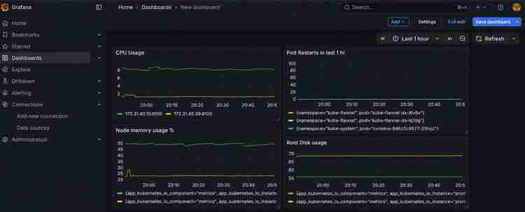

# AWS Kubernetes Observability Lab

A hands-on observability lab built on a **2-node Kubernetes cluster running on AWS EC2**. The goal is to demonstrate practical Kubernetes monitoring using **Prometheus, Grafana, Helm, node-exporter, kube-state-metrics, PromQL, and alert rules** while keeping the environment lightweight enough for a small learning account.

## Architecture

```text
AWS EC2
├── Control plane
│   ├── kube-apiserver
│   ├── scheduler
│   ├── controller-manager
│   └── node-exporter
│
└── Worker
    ├── Prometheus
    ├── Grafana
    ├── kube-state-metrics
    └── node-exporter
```

Cluster networking uses **Flannel**. The lab runs Kubernetes **v1.34.12** with **containerd**.

## What this project demonstrates

- Building and operating a kubeadm Kubernetes cluster on AWS EC2
- Deploying monitoring components with Helm
- Scraping Kubernetes and Linux node metrics with Prometheus
- Visualising CPU, memory, node health and filesystem usage in Grafana
- Writing PromQL queries
- Defining Prometheus alert rules for node health and resource pressure
- Designing around limited lab resources

## Repository layout

```text
.
├── README.md
├── helm/
│   ├── prometheus-values.yaml
│   └── grafana-values.yaml
├── dashboards/
│   └── kubernetes-node-monitoring.json
├── alerts/
│   └── node-alerts.yml
└── .gitignore
```

## Resource-conscious design

This is intentionally a **lab configuration**, not a production monitoring platform.

Prometheus is configured with:

- 6 hour retention
- no persistent volume
- Alertmanager disabled
- Pushgateway disabled
- node-exporter enabled
- kube-state-metrics enabled

Grafana persistence is also disabled.

This keeps disk and memory usage low. The trade-off is that metrics and Grafana state can be lost when Pods are recreated.

## Deploy Prometheus

```bash
kubectl create namespace monitoring

helm repo add prometheus-community https://prometheus-community.github.io/helm-charts
helm repo update

helm upgrade --install prometheus prometheus-community/prometheus \
  -n monitoring \
  -f helm/prometheus-values.yaml \
  --set-file serverFiles.alerting_rules\.yml=alerts/node-alerts.yml
```

Check the monitoring workloads:

```bash
kubectl get pods -n monitoring -o wide
```

## Deploy Grafana

```bash
helm repo add grafana https://grafana.github.io/helm-charts
helm repo update

helm upgrade --install grafana grafana/grafana \
  -n monitoring \
  -f helm/grafana-values.yaml
```

> The standalone Grafana chart used in this lab currently emits a deprecation warning. It is retained here to reproduce the lab environment; for a long-lived environment I would follow Grafana's current recommended deployment method.

## Access Grafana safely

From the Kubernetes control plane:

```bash
kubectl port-forward -n monitoring svc/grafana 3000:80
```

Then use an SSH tunnel from the local workstation to the control plane and open:

```text
http://localhost:3000
```

This avoids exposing Grafana directly to the public internet for the lab.

## Prometheus datasource

Grafana is provisioned with Prometheus as the default datasource:

```text
http://prometheus-server.monitoring.svc.cluster.local
```

A successful Grafana datasource test should report:

```text
Successfully queried the Prometheus API.
```

## Useful PromQL

### Target health

```promql
up
```

### Node memory usage %

```promql
100 * (1 - node_memory_MemAvailable_bytes / node_memory_MemTotal_bytes)
```

### Node CPU usage %

```promql
100 - (avg by(instance) (rate(node_cpu_seconds_total{mode="idle"}[5m])) * 100)
```

## Grafana dashboard

Import:

```text
dashboards/kubernetes-node-monitoring.json
```

The dashboard contains panels for:

- node CPU usage
- node memory usage
- node-exporter target health
- root filesystem usage

### Dashboard preview



The dashboard shows live CPU usage, node memory usage, pod restarts, and root disk usage across the lab nodes.

During import, select the Prometheus datasource when Grafana asks for `DS_PROMETHEUS`.

## Alert rules

`alerts/node-alerts.yml` contains three practical lab alerts:

- **NodeDown** — node-exporter target unavailable for 2 minutes
- **HighNodeCPU** — CPU usage above 85% for 5 minutes
- **HighNodeMemory** — memory usage above 85% for 5 minutes

Alertmanager is intentionally disabled in this lab, so Prometheus can evaluate the alert rules but no external notification is sent.

## Security

This repository intentionally excludes credentials and secrets. Never commit:

- AWS access keys
- EC2 private keys / `.pem` files
- Kubernetes admin kubeconfig
- Grafana admin passwords
- Kubernetes Secret manifests containing real credentials

## Next improvements

For a production-style evolution of this project I would add persistent storage, Alertmanager routing, TLS/Ingress, RBAC hardening, resource requests/limits, dashboard provisioning, and infrastructure-as-code.
